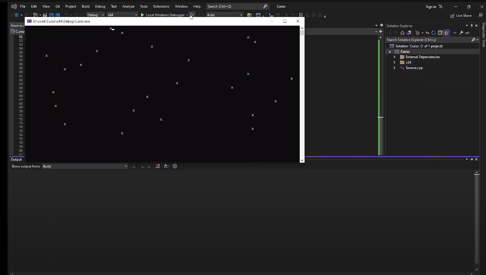

# CStars - A Modern C++ Console Animated Sky.
Created using modern C++ ISO and ANSII escape codes.   
Will print falling stars at a random position in the console.  
[Watch the video](https://youtu.be/BgM65Hc16PU)

